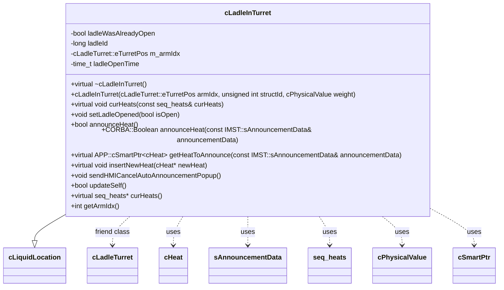

```mermaid
classDiagram
    class cLadleInTurret {
        -bool ladleWasAlreadyOpen
        -long ladleId
        -cLadleTurret::eTurretPos m_armIdx
        -time_t ladleOpenTime
        +virtual ~cLadleInTurret()
        +cLadleInTurret(cLadleTurret::eTurretPos armIdx, unsigned int structId, cPhysicalValue weight)
        +virtual void curHeats(const seq_heats& curHeats)
        +void setLadleOpened(bool isOpen)
        +bool announceHeat()
        +CORBA::Boolean announceHeat(const IMST::sAnnouncementData& announcementData)
        +virtual APP::cSmartPtr~cHeat~ getHeatToAnnounce(const IMST::sAnnouncementData& announcementData)
        +virtual void insertNewHeat(cHeat* newHeat)
        +void sendHMICancelAutoAnnouncementPopup()
        +bool updateSelf()
        +virtual seq_heats* curHeats()
        +int getArmIdx()
    }

    cLadleInTurret --|> cLiquidLocation
    cLadleInTurret ..> cLadleTurret : friend class
    cLadleInTurret ..> cHeat : uses
    cLadleInTurret ..> sAnnouncementData : uses
    cLadleInTurret ..> seq_heats : uses
    cLadleInTurret ..> cPhysicalValue : uses
    cLadleInTurret ..> cSmartPtr : uses
```

