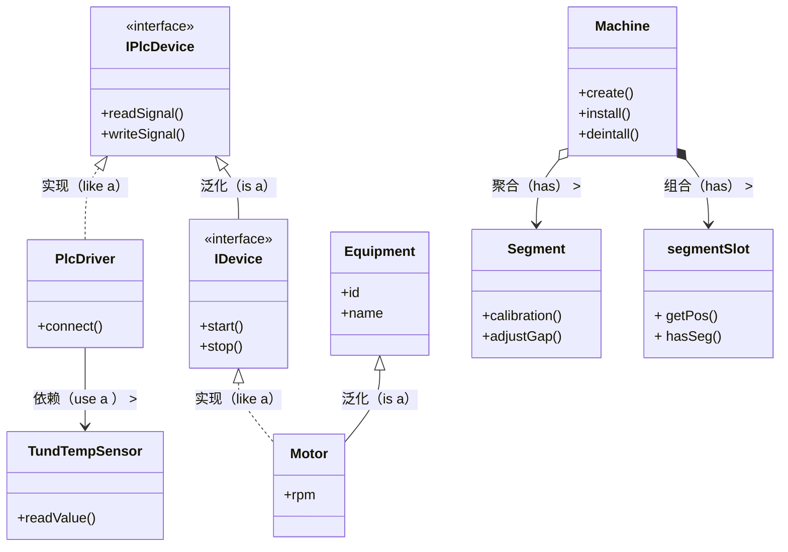
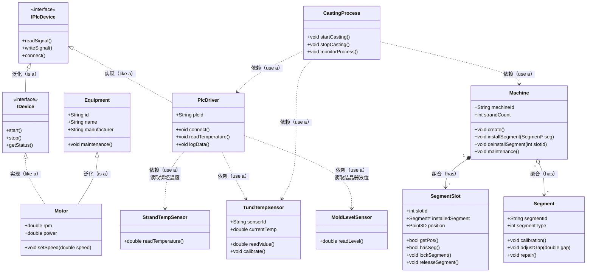
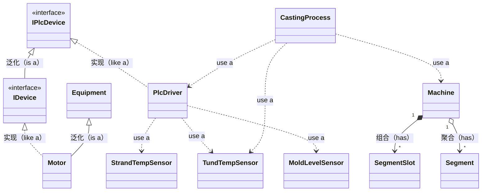

```mermaid
classDiagram
    %% ========= 接口与实现 ========= %%
    class IDevice {
        <<interface>>
        +start()
        +stop()
    }

    class IPlcDevice {
        <<interface>>
        +readSignal()
        +writeSignal()
    }

    IDevice <|.. Motor            : 实现（like a）
    IPlcDevice <|.. PlcDriver     : 实现（like a）
    IPlcDevice <|-- IDevice       : 泛化（is a）

    %% ========= 泛化（继承） ========= %%
    class Equipment {
        +id
        +name
    }

    class Motor {
        +rpm
    }

    Equipment <|-- Motor          : 泛化（is a）

    %% ========= 关联（普通 has-a） ========= %%
   

    %% ========= 聚合（可分离的整体-部分） ========= %%
    class TundTempSensor {
        +readValue()
    }

    class PlcDriver {
        +connect()
    }

    

    %% ========= 组合（强生命周期绑定） ========= %%
    class Machine {
        +create()
        +install()
        +deintall()
    }

    class Segment {
        +calibration()
        +adjustGap()
    }

    class segmentSlot{
        + getPos()
        + hasSeg()
    }

    Machine o--> Segment      :  聚合（has） >
    Machine *--> segmentSlot      :  组合（has） >

    %% ========= 依赖（use-a，临时调用） ========= %%
  PlcDriver --> TundTempSensor          : 依赖（use a ） >


```

```mermaid
classDiagram
    %% ========= 接口与实现 ========= %%
    class IDevice {
        <<interface>>
        +start()
        +stop()
        +getStatus()
    }

    class IPlcDevice {
        <<interface>>
        +readSignal()
        +writeSignal()
        +connect()
    }

    IDevice <|.. Motor            : 实现（like a）
    IPlcDevice <|.. PlcDriver     : 实现（like a）
    IPlcDevice <|-- IDevice       : 泛化（is a）

    %% ========= 泛化（继承） ========= %%
    class Equipment {
        +String id
        +String name
        +String manufacturer
        +void maintenance()
    }

    class Motor {
        +double rpm
        +double power
        +void setSpeed(double speed)
    }


    Equipment <|-- Motor          : 泛化（is a）
  

    %% ========= 组合（强生命周期绑定） ========= %%
    class Machine {
        +String machineId
        +int strandCount
        +void create()
        +void installSegment(Segment* seg)
        +void deinstallSegment(int slotId)
        +void maintenance()
    }

    class Segment {
        +String segmentId
        +int segmentType
        +void calibration()
        +void adjustGap(double gap)
        +void repair()
    }

    class SegmentSlot {
        +int slotId
        +Segment* installedSegment
        +Point3D position
        +bool getPos()
        +bool hasSeg()
        +void lockSegment()
        +void releaseSegment()
    }

    Machine "1" o--> "*" Segment      : 聚合（has）
    Machine "1" *--> "*" SegmentSlot  : 组合（has）

    %% ========= 依赖关系 ========= %%
    class TundTempSensor {
        +String sensorId
        +double currentTemp
        +double readValue()
        +void calibrate()
    }

    class PlcDriver {
        +String plcId
        +void connect()
        +void readTemperature()
        +void logData()
    }

    PlcDriver ..> TundTempSensor : 依赖（use a）

    class CastingProcess {
        +void startCasting()
        +void stopCasting()
        +void monitorProcess()
    }

    CastingProcess ..> Machine : 依赖（use a）
    CastingProcess ..> PlcDriver : 依赖（use a）
    CastingProcess ..> TundTempSensor : 依赖（use a）
    
    %% ========= 其他传感器依赖关系 ========= %%
    class MoldLevelSensor {
        +double readLevel()
    }
    
    class StrandTempSensor {
        +double readTemperature()
    }
    
    PlcDriver ..> MoldLevelSensor : 依赖（use a）<br>读取结晶器液位
    PlcDriver ..> StrandTempSensor : 依赖（use a）<br>读取铸坯温度

```

```mermaid
classDiagram
    %% ========= 接口与实现 ========= %%
    class IDevice {
        <<interface>>
    }

    class IPlcDevice {
        <<interface>>
    }

    IDevice <|.. Motor            : 实现（like a）
    IPlcDevice <|.. PlcDriver     : 实现（like a）
    IPlcDevice <|-- IDevice       : 泛化（is a）

    %% ========= 泛化（继承） ========= %%
    class Equipment
    class Motor

    Equipment <|-- Motor          : 泛化（is a）

    %% ========= 组合（强生命周期绑定） ========= %%
    class Machine
    class Segment
    class SegmentSlot

    Machine "1" o--> "*" Segment      : 聚合（has）
    Machine "1" *--> "*" SegmentSlot  : 组合（has）

    %% ========= 依赖关系 ========= %%
    class TundTempSensor
    class PlcDriver
    class CastingProcess

    PlcDriver ..> TundTempSensor : use a
    CastingProcess ..> Machine : use a
    CastingProcess ..> PlcDriver : use a
    CastingProcess ..> TundTempSensor : use a

    %% ========= 其他传感器 ========= %%
    class MoldLevelSensor
    class StrandTempSensor

    PlcDriver ..> MoldLevelSensor : use a
    PlcDriver ..> StrandTempSensor : use a

```

